<p align="center">
  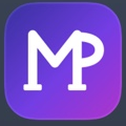
</p>

# 📅 My Panel App — Multi-Tenant Appointment Booking SaaS

> **Live Demo:admin-panel** [panel.mypanelapp.ir](https://panel.mypanelapp.ir) &nbsp;|&nbsp; **Admin Panel source:** *(private repo)* &nbsp;|&nbsp; 
 > **Live Demo:test booking-panel** [mypanelapp.ir/admin-1](https://mypanelapp.ir/admin-1) &nbsp; **User Client source:** *(private repo)*

   

---

## 🧠 What is My Panel App?

**My Panel App** is a full-stack multi-tenant SaaS platform that lets any service-based business — salons, consultants, coaches, clinics, agencies — launch their own branded appointment booking panel **in minutes**, without writing a single line of code and their customers can complete an appointment booking in less than 30 seconds without phone calls, WhatsApp messages, or manual coordination.

Each business gets:
- A **personal admin panel** to manage appointments, services, and availability
- A **public-facing customer booking panel** with a unique URL and QR code
- Full control over branding, language, theme color, and business info

---

## 🎯 Who Is It For?

| Business Type | Use Case |
|---|---|
| 🧴 Beauty & Wellness | Salons, barbershops, clinics booking clients |
| 💼 Consultants & Coaches | Session scheduling with receipt confirmation |
| 📣 Agencies | Managing multiple client service bookings |
| 🏥 Small Clinics | Patient appointment tracking |
| 🇮🇷 Iranian SMBs | Full Persian (RTL) support out of the box |

Any solo operator or small team that **currently manages appointments via phone calls or DMs** is the exact target user.

---

## ✨ Core Features (MVP)

### 🏢 Multi-Tenant Architecture
Every registered business operates in complete isolation — their own subdomain-style panel, their own data, their own customers. One platform, infinite businesses.

### 🌐 Bilingual (Persian / English) with RTL Support
Businesses can choose their customer panel language. The UI fully switches between **left-to-right (English)** and **right-to-left (Persian/Farsi)** layouts — including calendar, forms, and components — using `i18next` and dynamic `dir` attributes.

### 📆 Smart Availability Management
Admins set available days and time slots from a visual calendar. Customers only ever see genuinely open slots — no double-booking, no confusion.

### 🧾 Booking with PDF Receipt
After confirming an appointment, customers can **download a PDF receipt** instantly — containing service name, date, time, and business contact info.

### 🔐 Secure Authentication
- JWT access tokens + **HttpOnly cookie** refresh tokens
- Silent token refresh on app mount
- Queued concurrent 401 handling via Axios interceptors
- Email verification flow before dashboard access

### 📱 Fully Responsive
Both the admin panel and the customer booking panel are designed **mobile-first** and tested across all screen sizes.

### 🎨 Theme Customization
Admins pick a brand color from a palette. The customer panel reflects the chosen color across buttons, accents, and highlights — making each business feel truly theirs.

### 📲 QR Code & Shareable Link
Each business gets a unique booking URL and a **downloadable QR code** they can print, share on Instagram, or display at their location.

### 📊 Appointment Management
Admins view appointments in a **calendar view** or **table view**, filter by status (Scheduled / Completed / Cancelled), and take actions directly from the dashboard.

### 🖼️ Business Logo Upload
Businesses upload their logo, which appears on their customer panel — consistent branding without any design skills needed.

### 📲 Progressive Web App (PWA)
The admin panel is installable as a native-feeling app. Business owners can add it straight to their phone's home screen — complete with its own icon and splash screen — and open it like any other app, no browser chrome, no App Store required.

---

## 🛠️ Tech Stack

| Layer | Technology |
|---|---|
| **Frontend (Admin)** | React, TypeScript, Tailwind CSS, FullCalendar |
| **Frontend (Customer)** | React, TypeScript, Tailwind CSS |
| **Backend** | Node.js, Express.js |
| **Database** | MongoDB Atlas (via Mongoose) |
| **Auth** | JWT (access + refresh), HttpOnly cookies, bcrypt |
| **File Uploads** | Multer (logo, QR) |
| **PDF Generation** | jsPDF |
| **Internationalization** | i18next, react-i18next |
| **Deployment** | Vercel (frontends) + Render (backend) |
| **DNS / CDN** | Cloudflare |

---

## 📸 Screenshots

<table>
  <tr>
    <td align="center"><b>Customer Booking Panel</b></td>
    <td align="center"><b>Contact Info Step</b></td>
    <td align="center"><b>Booking Summary</b></td>
    <td align="center"><b>Booking Success</b></td>
  </tr>
  <tr>
    <td>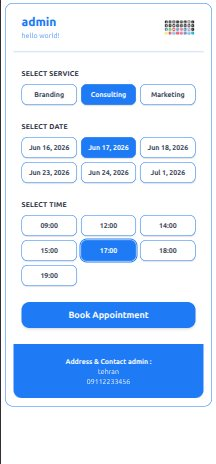</td>
    <td>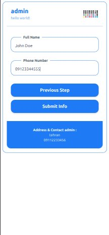</td>
    <td>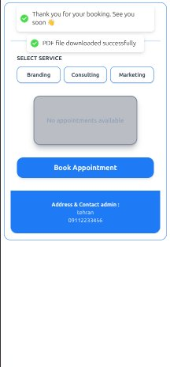</td>
    <td>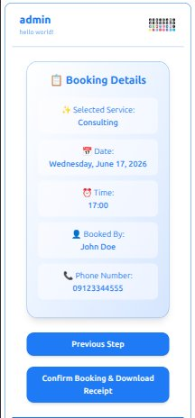</td>
  </tr>
  <tr>
    <td align="center"><b>Admin Calendar View</b></td>
    <td align="center"><b>Admin Table View</b></td>
    <td align="center"><b>Set Availability</b></td>
    <td align="center"><b>Profile Menu</b></td>
  </tr>
  <tr>
    <td>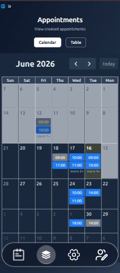</td>
    <td>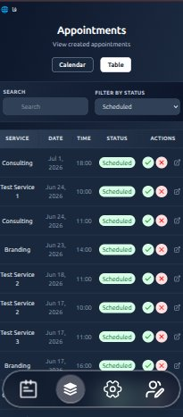</td>
    <td>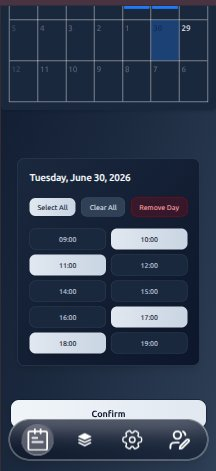</td>
    <td>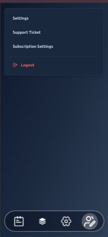</td>
  </tr>
  <tr>
    <td align="center"><b>Business Settings</b></td>
    <td align="center"><b>Services & QR Code</b></td>
    <td align="center"><b>Register</b></td>
    <td align="center"><b>Login</b></td>
  </tr>
  <tr>
    <td>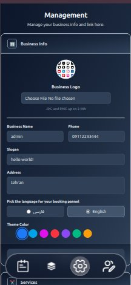</td>
    <td>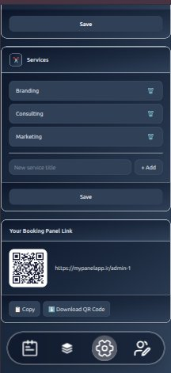</td>
    <td>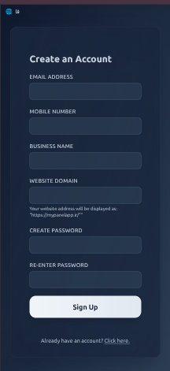</td>
    <td>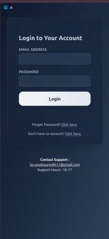</td>
  </tr>
</table>

<p align="center">
  <b>📲 Admin panel installed as a PWA on a phone's home screen</b><br/>
  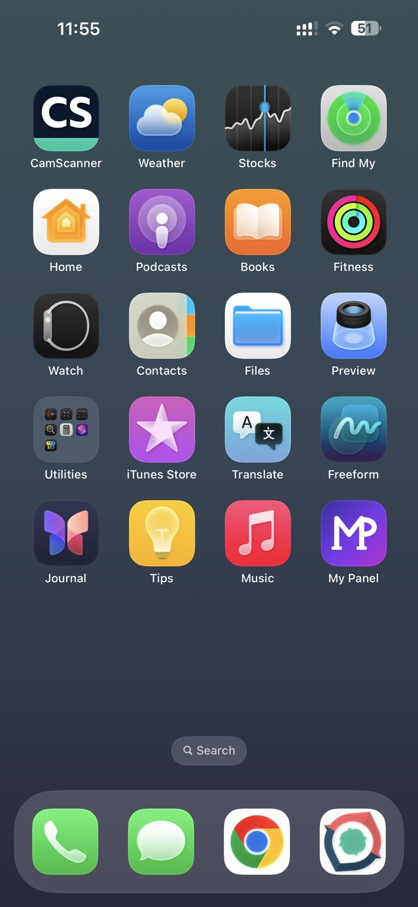
</p>

---

## 🗺️ Roadmap

The MVP is live. Here's what's coming next:

### 🔜 Short-Term
- [ ] **Profile management** — Change password, email, business name from settings
- [ ] **Support ticket system** — In-app help requests
- [ ] **Subscription settings** — Plan management UI
- [ ] **Breadcrumb navigation** — Improved UX flow in admin panel
- [ ] **Glassmorphism design upgrade** — Visual polish pass

### 🧩 Product Expansion
- [ ] **Per-service time slot customization** — Each service has its own duration and available slots
- [ ] **Service pricing** — Add price tags to services; receipts include cost breakdown
- [ ] **Customer phone verification** — OTP at booking time for fraud prevention
- [ ] **SMS reminders** — Notify business owners and customers before appointments (via Kavenegar)
- [ ] **Multi-admin support** — Assign staff members with role-based access
- [ ] **Discount codes & campaigns** — Create promo codes and limited-time offers
- [ ] **Blog & service descriptions** — Enrich customer panels with content and SEO
- [ ] **Business map location** — Google Maps embed on the customer panel
- [ ] **Next.js migration (Vaktly)** — SSR, SEO, improved performance for international markets

---

## 🏗️ Architecture Overview

```
┌─────────────────────────────────────────────┐
│                  Cloudflare CDN              │
└────────────┬───────────────────┬────────────┘
             │                   │
    ┌────────▼──────┐   ┌───────▼────────┐
    │  Admin Panel  │   │ Customer Panel │
    │  (Vercel)     │   │ (Vercel)       │
    └────────┬──────┘   └───────┬────────┘
             │                   │
             └────────┬──────────┘
                      │
             ┌────────▼────────┐
             │  Express API    │
             │  (Render)       │
             └────────┬────────┘
                      │
             ┌────────▼────────┐
             │  MongoDB Atlas  │
             │  (Frankfurt)    │
             └─────────────────┘
```

Each tenant's data is scoped by `businessId` across all collections. The customer panel resolves the business context from the URL slug.

---

## 👩‍💻 About the Developer

Built solo by **Farzane** — a frontend developer and computer engineering student passionate about building real products that solve real problems.

- 🐙 GitHub: [@Farzane2630](https://github.com/Farzane2630)
- 💼 Open to **remote frontend / full-stack opportunities**

---

## 📄 License

MIT — feel free to explore the architecture and learn from it.
